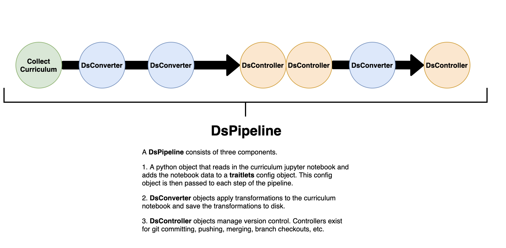
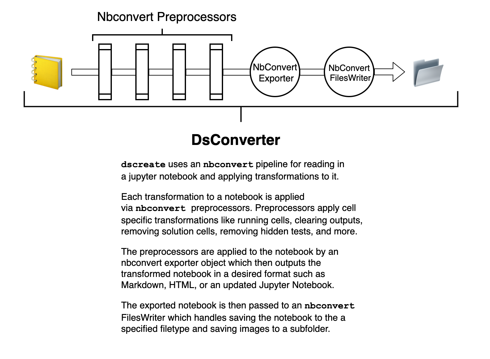

Developer Documentation
=======================

--------
Purpose
--------

This documentation is meant for those interested in contributing to ``dscreate`` 
or who are simply curious about how the software works.

**This document will cover:**
- The motivation for ``dscreate``
- The individual components  of a ``dscreate`` pipeline

----------
Motivation
----------

The origins of ``dscreate`` are based on code written by Alex Griffith in 2019, 
which 

- Splits a jupyter notebook into student facing and teacher facing content.
- Saves the student facing materials to a jupyter notebook on the ``master`` branch 
 of a git repository.
- Saves the the teacher facing materials to a jupyter notebook on the ``solution`` branch 
of a git repository.
- Saves the curriculum edit jupyter notebook to the ``curriculum`` branch
of a git repository.

The code written in 2019 works quite well and is used to this day for generating and deploying 
Flatiron Data Science curriculum.

In 2020 Flatiron School began developing data science curriculum that used ``nbgrader``
for autograded assessments. With the introduction of ``nbgrader`` came a new splitting
procedure that needed to be applied to curriculum notebooks.

An early version of ``dscreate`` was a package that primarily included individual
scripts for these two splitting procedures. In September 2021, ``dscreate`` was rewritten 
to use an ``nbconvert`` pipeline so the splitting procedures could be configured by the user, 
so users could understand the sequence of transformations without needing to read long ``.py`` scripts
from beginning to end, and so further development could follow consistent design conventions. 

The overall goal for this package is to centralize tooling used by the Flatiron School Data Science program. 
The contents of ``dscreate`` include code for splitting and transforming notebooks, synchronizing branches for 
assignments pushed to github, generating tests for notebook assignments, and a command line tool for launching
jupyter notebook in a cloud environment. 

At present, the branch splitting procedures are the most built out functionality of the package. 
The testing functionality is currently the least built out, and is an active development project
at Flatiron School.

--------------------------------
``dscreate`` Pipeline Components
--------------------------------

DsPipeline
----------

A DsPipeline is the top level pipeline of a notebook split procedure. The are the main functionality of notebook splitting apps
that are found in the ``apps/`` directory on github. A breakdown of the different components of a DsPipeline are visualized below. 

*Click the image to enlarge!*

DsConverter
-----------

A DsConverter is a nested pipeline which applies transformations to a jupyter notebook and saves the 
transformed notebook to disk. Dsconverter objects rely heavily on ``nbconvert`` which does most of heavy
lifting.

*Click the image to enlarge!*

